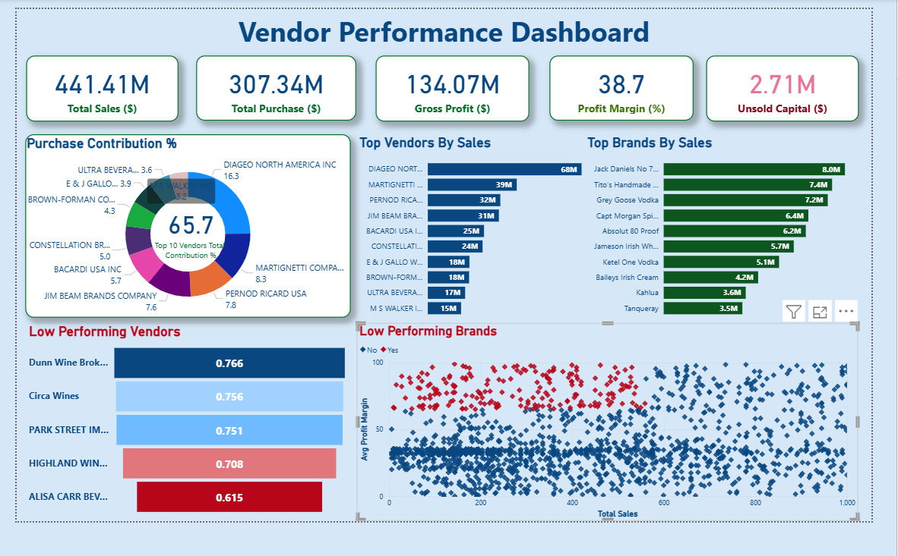

# 🧾 Vendor Performance Analysis – Retail Inventory & Sales

This project evaluates vendor efficiency and profitability to guide strategic purchasing and inventory management decisions in a retail environment.  
It combines **SQL**, **Python**, and **Power BI** to build a complete analytical pipeline — from raw data ingestion to visualization and insights.

---

##📌Table of Contents
- <a href="#Project Overview">Project Overview</a>
- <a href="#Business Objectives">Business Objectives</a>
- <a href="#Dataset">Dataset</a>
- <a href="# Tools & Technologies"> Tools & Technologies</a>
- <a href="# Project Structure"> Project Structure</a>
- <a href="# Data Preparation & Cleaning"> Data Preparation & Cleaning</a>
- <a href="# Exploratory Data Analysis (EDA)"> Exploratory Data Analysis (EDA)</a>
- <a href="# Statistical Insights"> Statistical Insights</a>
- <a href="# Dashboard Highlights (Power BI)">Dashboard</a>
- <a href="# Outcome">Project Outcome</a>

---

<h2><a class="anchor" id="Project Overview"></a>📊 Project Overview</h2>

Retail businesses often rely on multiple vendors for their products. Inefficient vendors, inaccurate pricing, and slow inventory turnover can directly affect profitability.  
This project aims to:
- Measure vendor performance using data-driven metrics  
- Identify underperforming brands and vendors  
- Analyze inventory turnover and bulk-purchase impacts  
- Provide actionable insights for cost optimization  

---

<h2><a class="anchor" id="Business Objectives"></a>🧠 Business Objectives</h2>

- Identify vendors contributing the most (and least) to sales and profit  
- Detect loss-making or low-margin transactions  
- Quantify savings from bulk purchasing  
- Understand vendor-wise inventory turnover  
- Validate performance differences statistically  

---

<h2><a class="anchor" id="Dataset"></a> 🗂️ Dataset</h2>

Multiple CSV/Excel files located in the **`data/`** folder:  
- `sales.csv`  
- `purchases.csv`  
- `vendor_invoice.csv`  
- `vendor_sales_summary.xlsx`  

After ingestion, the data is stored in a **SQLite database (`inventory.db`)** for further analysis.

---

<h2><a class="anchor" id="Tools & Technologies"></a> 🛠️ Tools & Technologies</h2>

| Category | Tools / Libraries |
|-----------|-------------------|
| Data Cleaning & Analysis | **Python**, Pandas, NumPy |
| Statistical Analysis | SciPy |
| Visualization | Matplotlib, Seaborn, Power BI |
| Database | SQLite, SQLAlchemy |

---

<h2><a class="anchor" id="Project Structure"></a> 🧩 Project Structure</h2>

```
vendor-performance-analysis/
│
├── README.md
├── .gitignore
├── requirements.txt
├── Vendor_Performance_Report.pdf
│
├── notebooks/
│   ├── EDA_Vendor_Data.ipynb
│   └── Vendor_Performance_Insights.ipynb
│
├── pipeline/
│   ├── ingestion_db.py
│   └── get_vendor_summary.py
│
├── dashboard/
    └── vendor_performance_dashboard.pbix


```

<h2><a class="anchor" id=" Data Preparation & Cleaning"></a>🧹 Data Preparation & Cleaning</h2>

## 🧹 Data Preparation & Cleaning
1. Removed transactions with:
   - `Gross Profit ≤ 0`
   - `Profit Margin ≤ 0`
   - `Sales Quantity = 0`
2. Merged lookup tables to create a consolidated **vendor summary table**
3. Converted numeric fields, handled missing values, removed whitespace  
4. Created new metrics:
   - `GrossProfit`
   - `ProfitMargin`
   - `StockTurnover`
   - `SalesToPurchaseRatio`

---

<h2><a class="anchor" id="Exploratory Data Analysis (EDA)"></a> 🔍 Exploratory Data Analysis (EDA)</h2>

Key findings from exploratory analysis:
- **Negative Values:** Detected loss-making and zero-margin transactions  
- **Outliers:** Found unusually high freight and purchase prices  
- **Correlations:**
  - Weak between *Purchase Price* and *Profit*  
  - Strong between *Purchase Qty* and *Sales Qty* (0.999)  
  - Slightly negative between *Profit Margin* and *Sales Price* (-0.18)

---

<h2><a class="anchor" id="Statistical Insights"></a> 📈 Statistical Insights</h2>

- **Top Vendors:** 10 vendors contribute to ~66% of total purchases  
- **Bulk Orders:** Up to 72% cost savings per unit in bulk purchases  
- **Inventory Turnover:** \$2.7M worth of slow-moving stock detected  
- **Profit Margin Analysis:**
  - High-performing vendors average ~31.2% margin  
  - Low-performing vendors average ~41.5% margin  
  - Statistical tests confirm significant performance differences  

---

<h2><a class="anchor" id="Dashboard Highlights (Power BI)"></a>  📊 Dashboard Highlights (Power BI)</h2>

The **Power BI Dashboard** (`vendor_performance_dashboard.pbix`) includes:
- Vendor-wise Sales, Profit, and Margin trends  
- Inventory Turnover and Unsold Stock analysis  
- Bulk Purchase Cost Savings  
- Vendor Heatmaps and Comparative KPIs  



---

<h2><a class="anchor" id="Outcome"></a>✅ Outcome </h2>

- Automated ETL pipeline from CSV → Database → Insights  
- Data-driven vendor performance benchmarking  
- Clear visualization of profit, cost, and turnover metrics  
- Ready-to-deploy BI dashboard for decision-making  